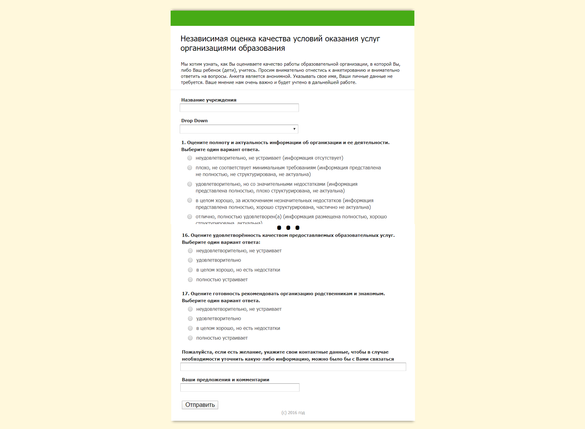

# html-questionnaire-edu
Опросник для министерства образоваия. 2016 год. "Независимая оценка качества условий оказания услуг организациями образования"
Данные передаются в гугл форму.

Изначально была светлая тема которую можно посмотеть в разделе "light_theme". Потом исправлено на зеленый фон.
Утверженный вариант:
https://opros.rane-brf.ru/

